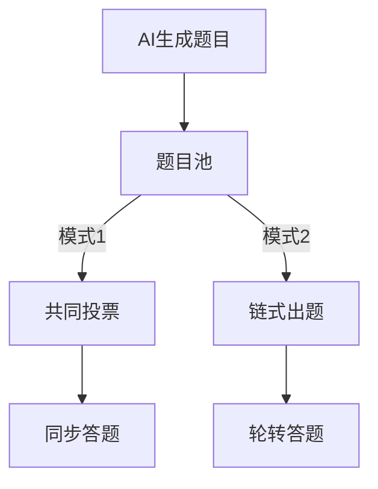

# Nervos Network 链上答题竞赛游戏

## 项目概述
基于Nervos CKB构建的去中心化多玩家答题竞技平台，集成Fiber支付通道实现链下交互，结合AI题目生成引擎，构建可验证的博弈类链游。

## 核心机制

### 1. 门票与押注系统
- 初始门票：500 CKB/玩家（可配置）
- 每轮押注：
  - 玩家从门票余额中划拨本轮押金（50-100 CKB）
  - 押金池实时计算：`总押金 = Σ(玩家有效押金)`
  - 押金分配算法：
```python
def reward_distribution(players):
    winners = [p for p in players if p.answered_correctly]
    if len(winners) == 0:
        # 全部答错，押金归合约
        return {"contract": sum(p.stake for p in players)}
    else:
        # 按胜者人数平均分配
        reward_per_winner = sum(p.stake for p in players) / len(winners)
        return {p.id: reward_per_winner for p in winners}
```

### 2. 多模式题目机制


## 技术架构

### Web前端层
1. **钱包集成**：React + ckb-js-sdk 实现CKB地址连接与交易签名
2. **状态管理**：Redux管理游戏状态与支付通道状态同步
3. **题目交互**：WebSocket实时接收AI生成题目

### 智能合约层
1. **GameManager**：游戏生命周期管理
2. **ChannelContract**：支付通道状态机
3. **OracleAdapter**：AI题目验证接口

### Fiber支付通道
- 通道建立：玩家↔合约 双向通道
- 状态更新签名：`SIG(玩家私钥, 通道状态哈希)`
- 结算条件：
  - 超时机制（24小时）
  - 余额耗尽
  - 玩家主动退出

### AI服务接口
```solidity
interface IAIOracle {
    function generateQuestion(
        uint256 gameId,
        string memory category
    ) external returns (
        string memory question,
        string memory correctAnswer
    );
}
```

## 安装与部署
```bash
# 前端工程安装
npm install
npm run dev

# 区块链环境安装
npm install -g @nervos/ckb-cli @nervos/fiber-channel-cli

# 部署合约
ckb-cli deploy ./contracts/GameManager

# 启动支付通道节点
fiber-channel start --network testnet
```

## 网页部署流程
1. 生产环境构建：
```bash
npm run build
# 部署至支持SPA的Web服务器（Nginx/Apache）
```

2. 环境要求：
- Node.js 18+
- Chrome/Firefox现代浏览器
- MetaMask或Neuron钱包扩展

## 测试网络
- Aggron Testnet
- CKB Node v0.105.0+
- Fiber Channel v2.3.1