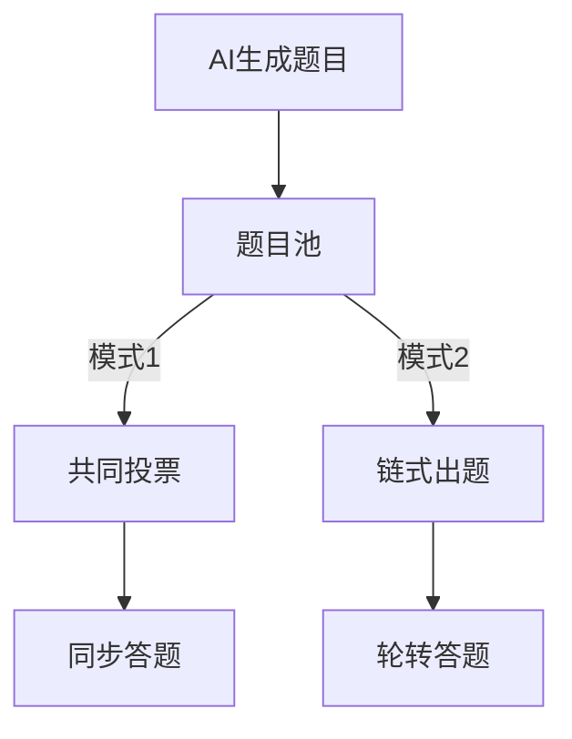
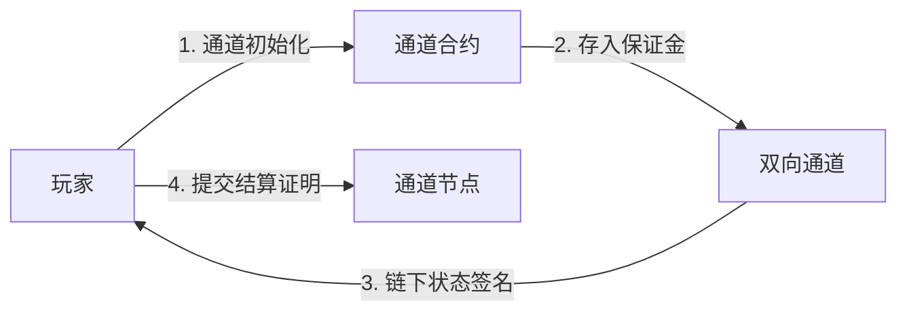

# Nervos Network 链上答题竞赛游戏

## 项目概述
基于Nervos CKB构建的去中心化多玩家答题竞技平台，集成Fiber支付通道实现链下交互，结合AI题目生成引擎，构建可验证的博弈类链游。

## 核心机制

### 1. 门票与押注系统
- 初始门票：500 CKB/玩家（可配置）
- 每轮押注：
  - 玩家从门票余额中划拨本轮押金（50-100 CKB）
  - 押金池实时计算：`总押金 = Σ(玩家有效押金)`
  - 押金分配算法：
```python
def reward_distribution(players):
    # 新增费用扣除逻辑
    # 仅扣除必要链上费用
    total_fee = 5 * len(players)  # 网络基础费用
    remaining_pool = sum(p.stake for p in players) - total_fee
    
    winners = [p for p in players if p.answered_correctly]
    if len(winners) == 0:
        return {"contract": remaining_pool + total_fee}
    else:
        reward_per_winner = remaining_pool / len(winners)
        return {p.id: reward_per_winner for p in winners}
```

### 2. 多模式题目机制


## 技术架构

### Web前端层
1. **CCC SDK集成**
   - 使用@nervos/ccc-cli构建CKB交易
   - 支持Cell/Transaction构建验证
   - 集成轻节点验证功能
2. **钱包集成**：React + CCC Wallet实现
   - 支持DApp浏览器扩展钱包
   - 提供SignerProvider签名能力
   - 实现CKB地址二维码扫码功能
2. **状态管理**：Redux管理游戏状态与支付通道状态同步
3. **题目交互**：WebSocket实时接收AI生成题目

### 智能合约层
1. **FeeManager**：
   - 自动费用扣除与分配
   - 支持费用参数动态调整
   - 提供费用透明度验证接口
2. **GameManager**：游戏生命周期管理
3. **ChannelContract**：支付通道状态机
3. **OracleAdapter**：AI题目验证接口

### Fiber支付通道


**核心参数配置**：
```javascript
// 通道配置示例
const CHANNEL_CONFIG = {
  challengePeriod: 86400, // 24小时挑战期
  minDeposit: 50000000,  // 最小保证金500 CKB
  maxPendingStates: 50,   // 最大未决状态数
  feeRate: 0.001         // 交易费率
};
```

**链下验证规则**：
1. 状态更新必须包含双方签名
2. 保证金变动需通过HTLC哈希时间锁
3. 争议期提交的证明需包含最近10个状态

**节点安装命令**：
```bash
npm install -g @fiberprotocol/channel-node # 安装Fiber节点
fiber-node init --network testnet         # 初始化测试网配置
```

### AI服务接口
```solidity
interface IAIOracle {
    function generateQuestion(
        uint256 gameId,
        string memory category
    ) external returns (
        string memory question,
        string memory correctAnswer
    );
}
```

## 安装与部署
```bash
# 前端工程安装
npm install
npm run dev

# 区块链环境安装
npm install -g @nervos/ckb-cli @nervos/fiber-channel-cli @nervos/ccc-cli

# 部署合约
ckb-cli deploy ./contracts/GameManager

# 启动支付通道节点
fiber-channel start --network testnet
```

## 网页部署流程
1. 生产环境构建：
```bash
npm run build
# 部署至支持SPA的Web服务器（Nginx/Apache）
```

2. 环境要求：
- Node.js 18+
- Chrome/Firefox现代浏览器
- MetaMask或Neuron钱包扩展

## 测试网络
- Aggron Testnet
- CKB Node v0.105.0+
- Fiber Channel v2.3.1
- CCC Wallet v1.2.0+
### 3. 交易费用管理
- 必要费用包含：网络基础费用（5 CKB/笔）
- 费用扣除规则：
  1. 优先扣除网络基础费用
  2. 当全部玩家答错时：
     - 系统获得当前奖池用于网络维护
  3. 存在正确回答时：
     - 答错玩家押金全额分配给正确玩家
     - 系统不收取任何额外费用
